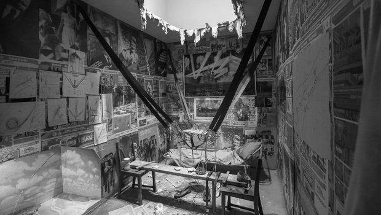

# Ramūnas Girdziušas

[Contact](https://aabbtree77.github.io/contact/contact.html), [Github](https://github.com/aabbtree77?tab=repositories), [Résumé](https://aabbtree77.github.io/pdfs/RamunasGirdziusasResume.pdf), [CV](https://aabbtree77.github.io/pdfs/RamunasGirdziusasCV.pdf)

  
Last Update: July 2024

I studied electrical engineering in Lithuania from 1994 to 1999, followed by research in computer science in Finland from 2000 to 2008. Later I did three postdoc projects and came back to Vilnius (Lithuania) in 2014 with the goal to become a [1x engineer](https://1x.engineer/). Take a look at some of my work: [3D effects](https://github.com/aabbtree77/twinpeekz2), [embedded software](https://github.com/aabbtree77/adast), [IoT with P2P](https://github.com/aabbtree77/esp32-vpn), and [web development](https://github.com/aabbtree77/law2).

# Selected Projects

## Work in Progress

Vilnius, Now.

Looking for ways and learning CRUD-based technology to automate massive tedious tasks, like student testing. My interim release includes [backend](https://github.com/aabbtree77/auth-starter-backend) and [frontend](https://github.com/aabbtree77/auth-starter-frontend) for a 3rd party-free user authentication which seems to be a pain-point in the TypeScript/Node ecosystem.

## [lawtrust.eu](https://lawtrust.eu/): [lawlt.eu](http://www.lawlt.eu/) [Improved](https://github.com/aabbtree77/law2)

Vilnius, February 2024.

Applied Tailwind CSS and Go string substitution to build a multilingual website for a lawyer who speaks nine languages. Porkbun.com and github pages.

## [Web-Log](https://github.com/aabbtree77/miniguestlog)

Vilnius, 2023-2024.

A MERN app to log geolocation of the last 50 visitors of this homepage. MongoDB Atlas, render.com, github pages, ipify.org, and geoip-lite API for the GeoLite data from MaxMind.

## [Paper Guillotine](https://github.com/aabbtree77/adast)

Vilnius, 2020 - 2024.

A joint work with Saulius Rakauskas (Infovega). We have been maintaining a real factory machine since February 2020 (last update February 2024). I wrote a microcontroller code in C (avr-gcc).

## [P2P Connectivity](https://github.com/aabbtree77/esp32-vpn)

Vilnius, 2021 - 2022.

A joint work with Saulius Rakauskas (Infovega): A remote plant watering system with ESP32, MicroPython, Mosquitto MQTT, Ubuntu and [awl](https://github.com/anywherelan/awl). Numerous tests of [hole punching](<https://en.wikipedia.org/wiki/Hole_punching_(networking)>) through layers of routers and the use of the P2P network other than torrents (golibp2p).

## [Volumetrically-Lit Sponza (Go, Nim)](https://github.com/aabbtree77/twinpeekz2)

Vilnius, 2020 - 2022.

Implemented volumetric lighting in [Go](https://github.com/aabbtree77/twinpeekz) and [Nim](https://github.com/aabbtree77/twinpeekz2) (forward rendering, shadow mapping, PBR, 3D ray marching, OpenGL) following [Balázs Tóth, Tamás Umenhoffer (2009)](https://diglib.eg.org/handle/10.2312/egs.20091048.057-060), and [Tomas Öhberg (2017)](https://gitlab.com/tomasoh/100_procent_more_volume).

## [Tensor Algebras](https://aabbtree77.github.io/shankland/shankland.html)

Vilnius, 2015 - 2020.

Verified several tensor algebras of Donn G. Shankland.

["Après la montagne, il y a la montagne..." &#8722; Desireless, Hari om Ramakrishna (1989)](https://www.youtube.com/watch?v=18rZv8qWZqA)

## [MNIST-0.17 (Python)](https://github.com/aabbtree77/MNIST-0.17)

Vilnius, 2014 - 2015, 2020.

Confirmed that Jonas Matuzas' CNN model is one of the most convincing results in the MNIST digit recognition.

## [3D Shape Normalization (Matlab)](https://diglib.eg.org/handle/10.2312/3dor.20141044.009-015)

PostDoc Chronicles 3: Lugano, 2013-2014. Mapped the "Unroll the Swiss Roll" problem to the fast multipole method-based electrostatics with an approximate distance
constraint handling (simple projections ala Karmarkar and Cimmino in linear algebra). Davide Boscaini implemented the constraint gradient exactly and pushed the error rates.

## [Cloud Computing (Scilab)](https://hal.archives-ouvertes.fr/hal-00723427)

PostDoc Chronicles 2: Saint-Étienne, 2012-2013.

Optimization of the fluid flow which was implemented before me with OpenFOAM, CATIA, STAR CCM+ and ParaView, running on the ProActive PACA Grid cloud (INRIA) via the Scilab-to-Java bridge managed by Fabien Viale. The optimization involved kriging and CMA-ES as the meta-optimizer of the expected multi-point improvement whose MC integration I sped up with a specialized unscented transform. See the [slides](https://github.com/aabbtree77/aabbtree77.github.io/blob/main/pdfs/optimization2012.pdf).

## [Modified Thomson Problem (Unpublished)](https://github.com/aabbtree77/aabbtree77.github.io/blob/main/pdfs/ucla2009.pdf)

PostDoc Chronicles 1: Los Angeles, 2008-2009.

Prof. Dario Ringach suggested the modified Thomson problem which led me to some precise theorems. However, I failed to extend them to a larger program. It all got discontinued due to irrelevance to neurobiology. See the unpublished beginnings in the title link.

My neighbor was hit with a baseball bat by some robbers. He spent a week in the hospital and received a twelve-thousand-dollar bill to pay which was covered by the UCLA, but not entirely, if I remember correctly.

## [Anisotropic Diffusion Filters](https://aaltodoc.aalto.fi/handle/123456789/2999)

My DSc (PhD) thesis, Espoo 2002-2008.

The problem of revealing an edge in an additive Gaussian noise with the optimally stopped diffusion of the observed values. It is mostly this **[IJCNN-2005](https://ieeexplore.ieee.org/document/1555991)** paper further polished in **[ICCV2007](https://ieeexplore.ieee.org/document/4408895)** and **[ACCV2007](https://link.springer.com/chapter/10.1007/978-3-540-76386-4_77)**.

  

Daffertshofer-Haken-1994 as a strategically wrong, but inspiring paper,
E.T. Jaynes, machine learning in 2000s, my great nine years in Finland: Suomenlinna, Serena... Vaida Rutkauskaitė, Alexander Ilin, Vitaliy Nevdacha,
Mykola Ivanchenko, Elia Liitiäinen, Jan-Hendrik Schleimer, Jarrod Creado, Leo Michael,
Jaakko Martti Johannes Miettinen, Ville Rantamaula, Dexter He,
Mikko Katajamaa, Petteri Räisänen, Jaakko Peltonen, Petri Hyötylä, Matthieu Molinier, Jagdeesh Rajani, Sandro Grech, Ivan Ore, Giedrius Zavadskis,
Anita Bisi, Sergej Doudorov, Maxim Govtva, Paola Huaynate... I remember you.

  

## UNIPEN Parser (Matlab)

May 2000.

My first job, at the CIS Lab, Helsinki University of Technology (TKK) in Finland (working with Jorma Laaksonen). During the first two weeks I wrote a parser which loaded UNIPEN data into Matlab structures. The code did not survive, but it was a non-recursive use of fscanf to read data the way it was stored.

<table align="center">
    <tr>
    <th align="left">Ilya Kabakov. The Man Who Flew into Space from his Apartment, 1988</th>
    </tr>
    <tr>
    <td>
    
    </td>
    </tr>
</table>

 
