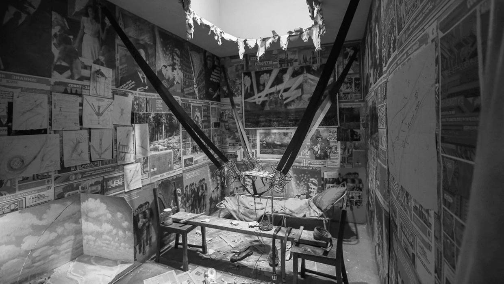

 

<table align="center">
    <tr>
    <th align="center">Ilja Kabakov. The Man who Flew Into Space from His Apartment, 1986</th>
    </tr>
    <tr>
    <td>
    
    </td>
    </tr>
</table>

 

1. Selected Projects
====================
  

### [(ATmega16, C) $\rightarrow$ Paper Guillotine](https://github.com/aabbtree77/adast){: class="w3-monospace w3-text-black"}

A joint work with Saulius Rakauskas (Infovega). He dissected hardware, designed the board and prepared factory requirements, I wrote microcontroller code in C (avr-gcc). This marvel machine (repaired by us in 2020) is still in operation (2022).

 

###  [(ESP32, MicroPython) $\rightarrow$ Wi-Fi Control](https://github.com/aabbtree77/esp32-mqtt-experiments){: class="w3-monospace w3-text-black"}

IoT with ESP32, MQTT and MicroPython. Despite a very low RAM and limited software, ESP32 enables one to control sensors over Wi-Fi, even with resilience.

  

### [(OpenGL, Go) $\rightarrow$ Volumetrically-Lit Sponza](https://github.com/aabbtree77/twinpeekz){: class="w3-monospace w3-text-black"}

A full volumetric lighting in Go (forward rendering, shadow mapping) following the C/C++ work of **[Balázs Tóth, Tamás Umenhoffer (2009)](https://diglib.eg.org/handle/10.2312/egs.20091048.057-060)** and **[Tomas Öhberg (2017)](https://gitlab.com/tomasoh/100_procent_more_volume)**. The code shows the impact of a garbage collector in a realistic (multi-pass, PBR-based) OpenGL pipeline.

  

### [MNIST-0.17 (Python)](https://github.com/aabbtree77/MNIST-0.17){: class="w3-monospace w3-text-black"}

A confirmation that Jonas Matuzas' CNN model is the most convincing result in the MNIST digit recognition so far (2022).

  

### [FMM Simulation $\rightarrow$ 3D Shape Normalization (MATLAB)](https://diglib.eg.org/handle/10.2312/3dor.20141044.009-015){: class="w3-monospace w3-text-black"}

PostDoc Chronicles 3: Lugano, 2013-2014. I managed to map the "Unroll the Swiss Roll" problem to electrostatics and approximate distance 
constraint handling via simple projections ala Karmarkar and Cimmino in linear algebra. Davide Boscaini handled the constraint gradient exactly and pushed the error rates.

 

### [Cloud Computing (Scilab)](https://hal.archives-ouvertes.fr/hal-00723427){: class="w3-monospace w3-text-black"}

PostDoc Chronicles 2: Saint-Étienne, 2012-2013. Optimization of geometry to minimize a pressure drop simulated with the Navier-Stokes flow implemented before me with OpenFOAM, CATIA, STAR CCM+ and ParaView, running on the ProActive PACA Grid (INRIA) cloud via Scilab-to-Java bridge managed by Fabien Viale. Minimization involved kriging and CMA-ES as a meta-optimizer of the expected multi-point improvement whose MC integration I sped up with a specialized unscented transform.

To describe the parallelization part of the problem, a simple analogy will suffice: Imagine moving in a 3D game faster than the world around you being generated, you may get stuck inside walls or places that cannot be escaped. In order to faster predict the next optimal candidate batch, one reads the available cloud node result immediately, but the multi-point world is not loaded yet to make a movement. One can see how this is resolved in the report aiming at a synchronous progress just running faster/asynchronously.

  
 
### [Modified Thomson Problem (Unpublished)](https://github.com/aabbtree77/aabbtree77.github.io/blob/main/pdfs/ucla2009.pdf){: class="w3-monospace w3-text-black"}

PostDoc Chronicles 1: Los Angeles, 2008-2009. A failure, though rank arguments and Eq. 30 came up somewhat unexpectedly. 
The ability to linearize a problem and investigate its Jacobian structure 
is underrated, but I could not make it into a bigger program.

  

<table align="center">
    <tr>
    <th align="center"> Ramunas Girdziusas, D.Sc. (Tech.)</th>
    </tr>
    <tr>
    <td align="center">
    
    </td>
    </tr>
</table>

  
 
### [Anisotropic Diffusion Filters (DSc Thesis)](https://aaltodoc.aalto.fi/handle/123456789/2999){: class="w3-monospace w3-text-black"}

My DSc (PhD) thesis, Espoo 2002-2008. Essentially, it is this **[IJCNN-2005](https://ieeexplore.ieee.org/document/1555991)** paper polished in **[ICCV2007](https://ieeexplore.ieee.org/document/4408895)** and **[ACCV2007](https://link.springer.com/chapter/10.1007/978-3-540-76386-4_77)**. A good test case could have been the bilateral upscaling stage in volumetric light rendering. 
 
One could further pytorch these models by wrapping them into transformer networks or making a leap into **[convolutions](https://distill.pub/2021/understanding-gnns/)** **[on](https://blog.twitter.com/engineering/en_us/topics/insights/2021/graph-neural-networks-as-neural-diffusion-pdes)** **[graphs](https://twitter.com/mmbronstein/status/1407260749295239168)**, but the state of the art CNN might be tough to beat.
 

  

  R.I.P.
   

  Daffertshofer-Haken-1994 as a strategically wrong, but inspiring paper,
  Jaynes, machine learning in 2000s, my great nine years in Finland: Suomenlinna, Serena... Vaida Rutkauskaitė, Alexander Ilin, Vitaliy Nevdacha, 
  Mykola Ivanchenko, <strong>Elia Liitiäinen</strong>, Jan-Hendrik Schleimer, Jarrod Creado, <strong>Leo Michael</strong>, 
  <strong>Jaakko Martti Johannes Miettinen</strong>, Ville Rantamaula, Dexter He, 
  Mikko Katajamaa, Petteri Räisänen, Jaakko Peltonen, Petri Hyötylä, Matthieu Molinier, Jagdeesh Rajani, Sandro Grech, Ivan Ore, Giedrius Zavadskis, 
  Anita Bisi, Sergej Doudorov, Maxim Govtva, Paola Huaynate... I remember you.
  

  

  <table align="center">
  <tr>
  <td>
 “You're a picture on a piano.”
</td>
  </tr>
  <tr>
  <td colspan="1" style="text-align:right">
- Get Carter, 2000
</td>
  </tr>
  </table>

 

  

    <ul class="qube cube03">
      <li class="front"></li>
      <li class="left"></li>
      <li class="back"></li>
      <li class="right"></li>
      <li class="top"></li>
      <li class="bottom"></li>
    </ul>
  

 

 

 

2. Bookmarks
============

 

Chekhov 
-------

  [Антон Павлович Чехов, 1878](https://en.wikipedia.org/wiki/Platonov_(play)){: class="w3-monospace"} $\rightarrow$ 
  [Неоконченная пьеса для механического пианино, 1977](https://youtu.be/0OXkvpVCZEA?t=5557){: class="w3-monospace"}

  [Антон Павлович Чехов, 1884](https://en.wikipedia.org/wiki/The_Shooting_Party_(Chekhov_novel)){: class="w3-monospace"} $\rightarrow$ 
  [Мой ласковый и нежный зверь, 1978](https://www.youtube.com/watch?v=0mSHQgpeCbQ){: class="w3-monospace"}

  [Антон Павлович Чехов, 1893](https://en.wikipedia.org/wiki/The_Black_Monk){: class="w3-monospace"} $\rightarrow$ 
  [Черный монах, 1988](https://www.youtube.com/watch?v=yPBIRUv_LHw){: class="w3-monospace"}

  [Антон Павлович Чехов, 1898](https://en.wikipedia.org/wiki/Uncle_Vanya){: class="w3-monospace"} $\rightarrow$ 
  [Дядя Ваня, 1986](https://youtu.be/JYBBYKKi1W4?t=4550){: class="w3-monospace"}

  [Антон Павлович Чехов, 1900](https://en.wikipedia.org/wiki/Three_Sisters_(play)){: class="w3-monospace"} $\rightarrow$ 
  [Три сестры, 1994](https://www.youtube.com/watch?v=bbwGt1oshkc&t=2094s){: class="w3-monospace"}

 

SF/HF
-----

  [John Wyndham, 1951](https://en.wikipedia.org/wiki/The_Day_of_the_Triffids){: class="w3-monospace"} $\rightarrow$ 
  [28 Days Later..., 2002](https://www.youtube.com/watch?v=1cbh8X5X2vk){: class="w3-monospace"} 

  [Stanisław Lem, 1961](https://en.wikipedia.org/wiki/Solaris_(novel)){: class="w3-monospace"} $\rightarrow$ 
  [Солярис, 1972](https://www.youtube.com/watch?v=FcglyhUre4w){: class="w3-monospace"} $\rightarrow$ 
  [Solaris, 2002](https://www.youtube.com/watch?v=nqHzFiun1p4){: class="w3-monospace"}

  [Ray Nelson, 1963](https://pvto.weebly.com/uploads/9/1/5/0/91508780/eight_o%E2%80%99clock_in_the_morning-nelson.pdf){: class="w3-monospace"} $\rightarrow$ 
  [They Live, 1988](https://www.youtube.com/watch?v=g4XiKChyK7A){: class="w3-monospace"}

  [Philip Kindred Dick, 1966](https://en.wikipedia.org/wiki/We_Can_Remember_It_for_You_Wholesale){: class="w3-monospace"} $\rightarrow$ 
  [Total Recall, 1990](https://www.youtube.com/watch?v=tvHgxTubFSQ){: class="w3-monospace"} $\rightarrow$
  [Total Recall, 2012](https://youtu.be/6GqF9MNZU_s?t=128){: class="w3-monospace"}

  [Joan Lindsay, 1967](https://en.wikipedia.org/wiki/Picnic_at_Hanging_Rock_(novel)){: class="w3-monospace"} $\rightarrow$ 
  [Picnic at Hanging Rock, 1975](https://youtu.be/-ueVib29wg0?t=1471){: class="w3-monospace"}

  [Philip Kindred Dick, 1968](https://en.wikipedia.org/wiki/Do_Androids_Dream_of_Electric_Sheep%3F){: class="w3-monospace"} $\rightarrow$ 
  [Blade Runner, 1982](https://www.youtube.com/watch?v=ptKGSp4YpUs){: class="w3-monospace"} $\rightarrow$
  [Blade Runner 2049, 2017](https://www.youtube.com/watch?v=i9ovnRX5-SY){: class="w3-monospace"}
  
 

Make $\rightarrow$ Remake
-----------------------------

  [Nat King Cole, 1949](https://www.youtube.com/watch?v=vokjaW1eTGY){: class="w3-monospace"} $\rightarrow$
  [CeeLo Green, 2009](https://www.youtube.com/watch?v=sNH_qfAuwO0){: class="w3-monospace"}

  [My Favorite Things, 1959](https://www.youtube.com/watch?v=28wViKM_Sig){: class="w3-monospace"} $\rightarrow$
  [Ariana Grande, 2019](https://www.youtube.com/watch?v=QYh6mYIJG2Y){: class="w3-monospace"} 

  [The Hollies, 1974](https://www.youtube.com/watch?v=HkUgpfZ3rjQ){: class="w3-monospace"} $\rightarrow$
  [Radiohead, 1992](https://www.youtube.com/watch?v=XFkzRNyygfk){: class="w3-monospace"} $\rightarrow$
  [Lana Del Rey, 2017](https://www.youtube.com/watch?v=axRMZqUNVEw){: class="w3-monospace"}

  [Эдуард Николаевич Артемьев, 1979](https://www.youtube.com/watch?v=sJj9y4t9UnU){: class="w3-monospace"} $\rightarrow$
  [PPK, 2001](https://www.youtube.com/watch?v=Rce8QnuFRVk){: class="w3-monospace"}
  
 

Band $\rightarrow$ Solo
---------------------------

  [Ace of Base, 1995](https://www.youtube.com/watch?v=wh-07BzfgYY&t=37s){: class="w3-monospace"} $\rightarrow$
  [Linn Berggren, 1997](https://www.youtube.com/watch?v=OCmoS-VzBSE&list=RDEMn7k33J47oypPqkQTAawmog&index=24){: class="w3-monospace"} 

  [2 Unlimited, 1995](https://www.youtube.com/watch?v=U0jNQyNGm4g){: class="w3-monospace"} $\rightarrow$
  [Anita Doth, 1999](https://www.youtube.com/watch?v=ozKzBRl4a7A){: class="w3-monospace"}

 

Stereo
------

  [Caroline Catherine Müller, 1999](https://youtu.be/ZcoP3-ProLE?t=238){: class="w3-monospace"} 

 

Tensor $\rightarrow$ Algebra
--------------------------------

  [Am. J. Phys. 38, 1239 (1970)](https://aapt.scitation.org/doi/10.1119/1.1976018?cookieSet=1){: class="w3-monospace"}

  [Phys. Rev. D 64, 125013 (2001)](https://journals.aps.org/prd/abstract/10.1103/PhysRevD.64.125013){: class="w3-monospace"}

  [Phys. Rev. D 67, 085021 (2003)](https://journals.aps.org/prd/abstract/10.1103/PhysRevD.67.085021){: class="w3-monospace"}

  [Phys. Rev. D 67, 125011 (2003)](https://journals.aps.org/prd/abstract/10.1103/PhysRevD.67.125011){: class="w3-monospace"}

 

Functional Equation $\rightarrow$ PDE
-----------------------------------------

  [Павел Андреевич Жилин. Модифицированная теория симметрии тензоров и тензорных инвариантов, 2003](http://teormeh.net/Zhilin_New/pdf/Zhilin_Invariant_rus.pdf){: class="w3-monospace"}

 

KdV $\rightarrow$ Elliptic Curve
------------------------------------

  [Letterio Gatto, Parham Salehyan. Hasse-Schmidt Derivations... Sect. 1.1, 2016](https://www.amazon.com/Hasse-Schmidt-Derivations-Grassmann-Algebras-Applications/dp/3319318411){: class="w3-monospace"}

  [Georgios Pastras. Four Lectures on Weierstrass Elliptic Function... 2017](https://arxiv.org/abs/1706.07371){: class="w3-monospace"}

 

Age of Empires 1997 in a Nutshell
----------------------------------

  [Amelia Clarke, towerdefense, 2017](https://github.com/rsaihe/towerdefense){: class="w3-monospace"}

 

Classical Mechanics (Done Right)
--------------------------------

  [David H. Eberly. Game Physics, 2010](https://www.amazon.com/Game-Physics-David-H-Eberly/dp/0123749034){: class="w3-monospace"}

  [Randy Gaul... light-weight and fast 3D physics engine in C++, 2014-2020](https://github.com/RandyGaul/qu3e){: class="w3-monospace"}

 

Classical Nonmechanics
----------------------

  [Фёдор Михайлович Достоевский. Бесы, 1872](https://en.wikipedia.org/wiki/Demons_(Dostoevsky_novel)){: class="w3-monospace"} 

  [Иосиф Александрович Бродский. Меньше единицы, 1976](https://en.wikipedia.org/wiki/Joseph_Brodsky#/media/File:Brodskij_Wilno.jpg){: class="w3-monospace"}

  [Девочка и дельфин, 1979](https://www.youtube.com/watch?v=wSDbCLNPnM8){: class="w3-monospace"}

   

Валерий Борисович Гаркалин (1954-2021)
--------------------------------------

  [Катала, 1989](https://youtu.be/XZybF8ywsz8?t=3458){: class="w3-monospace"}

  [Белые одежды, 1992](https://youtu.be/WfGgo1hbZRU?t=3048){: class="w3-monospace"}

 

Сергей Александрович Соловьёв (1944-2021)
-----------------------------------------

  [Сто дней после детства, 1975](https://www.youtube.com/watch?v=0PGARFpoSuQ&list=PLaVercZoOg7eNOS5NXPiBswBRzphjpOrA&index=4){: class="w3-monospace"}

  [Мелодии белой ночи, 1976](https://youtu.be/6leMPSjKY5s?list=PLaVercZoOg7eNOS5NXPiBswBRzphjpOrA&t=1809){: class="w3-monospace"}

  [Спасатель, 1980](https://youtu.be/M7ShKsz33Js?list=PLaVercZoOg7eNOS5NXPiBswBRzphjpOrA&t=5218){: class="w3-monospace"}

  [Чёрная роза — эмблема печали, красная роза — эмблема любви, 1989](https://youtu.be/TDUTB55asA4?list=PLaVercZoOg7eNOS5NXPiBswBRzphjpOrA&t=3940){: class="w3-monospace"}

  [Три сестры, 1994](https://youtu.be/bbwGt1oshkc?list=PLaVercZoOg7eNOS5NXPiBswBRzphjpOrA&t=565){: class="w3-monospace"}
  
 

Soviet
------

  [Семнадцать мгновений весны, 1973](https://youtu.be/8ftGvvUD1Nw?t=14){: class="w3-monospace"} 

  [Место встречи изменить нельзя, 1979](https://youtu.be/-uzl9jQv8PY?t=21185){: class="w3-monospace"}

  [Долгая дорога в дюнах, 1980](https://youtu.be/5M56g-QPZTI?t=953){: class="w3-monospace"} 

  [Мираж, 1983](https://youtu.be/GbgHkFXDh6A?t=156){: class="w3-monospace"}

  [Гостья из будущего, 1984](https://youtu.be/jbajZzh0au4?t=237){: class="w3-monospace"}

  

Post-Soviet
-----------

  [977, 2006](https://youtu.be/aGAI-TCmDbg?t=1586){: class="w3-monospace"} 

  

Non-Soviet
----------

  [La Piovra, 1984-1989](https://www.youtube.com/watch?v=yg4GO76RucA){: class="w3-monospace"} 

  [Twin Peaks, 1990-1991](https://www.youtube.com/watch?v=9_tJskJqWWs){: class="w3-monospace"}

 

French
------

  [Les bonnes femmes, 1960](https://www.imdb.com/title/tt0053666/mediaviewer/rm456675328?ref_=ttmi_mi_all_bts_15){: class="w3-monospace"} 

  [Du côté d'Orouët, 1971](https://youtu.be/8JbiFS2o5uU?t=3376){: class="w3-monospace"}

  [Marie baie des anges, 1997](https://www.youtube.com/watch?v=J5m-XiUvLgg){: class="w3-monospace"}

 

Australian
----------

  [Walkabout, 1971](https://www.youtube.com/watch?v=1gCaR4F9MfU){: class="w3-monospace"}

  [Picnic at Hanging Rock, 1975](https://youtu.be/-ueVib29wg0?t=1263){: class="w3-monospace"}

  [All the Rivers Run, 1983](https://www.youtube.com/watch?v=3prczaXXr5g){: class="w3-monospace"}

 

Pending
-------

  [Funkadelic. Maggot Brain, 1971](https://www.youtube.com/watch?v=xby5467EbdU){: class="w3-monospace w3-text-blue"} 

  [The Cure. Fascination Street, 1989](https://www.youtube.com/watch?v=7ZsQdLlvuk4){: class="w3-monospace w3-text-blue"}

  [Desireless. Hari ôm Ramakrishna, 1989](https://www.youtube.com/watch?v=18rZv8qWZqA){: class="w3-monospace w3-text-blue"}

  [Aphex Twin. Tha, 1992](https://www.youtube.com/watch?v=LGC90fmf8gw){: class="w3-monospace w3-text-blue"}

  [David Bowie, Brian Eno. I'm Deranged, 1995](https://www.youtube.com/watch?v=aepBpZ3kXek){: class="w3-monospace w3-text-yellow"}

  [Björk. All Is Full of Love, 1999](https://www.youtube.com/watch?v=u0cS1FaKPWY){: class="w3-monospace w3-text-yellow"} 

  [Mind Over Matter. A Night In Mogul's Garden, 2000](https://www.youtube.com/watch?v=P3jlUpej-Hw){: class="w3-monospace w3-text-yellow"}

  [Muse 2009, Guy Ritchie 2010](https://www.youtube.com/watch?v=fZd9mKJcOR0){: class="w3-monospace w3-text-yellow"}

 

