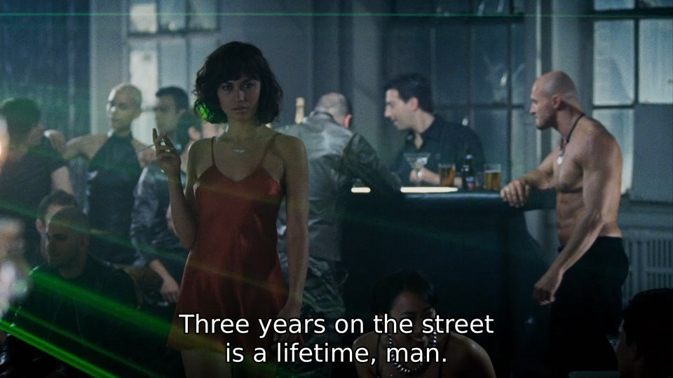

 

<table align="center">
    <tr>
    <th align="center"> Volumetric Lighting in Max Payne (2008)</th>
    </tr>
    <tr>
    <td>
    
    </td>
    </tr>
</table>

 

Selected Projects
==================================================

  

### <https://github.com/aabbtree77/adast>{: class="w3-monospace w3-text-blue"}

A joint work with Saulius Rakauskas (Infovega) to repair an old factory machine (the paper guillotine). He dissected hardware, designed the board and set up the software requirements, I wrote the microcontroller code in C (avr-gcc). This marvel machine (repaired by us in 2020) is still in operation (2022).

 

### <https://github.com/aabbtree77/esp32-mqtt-experiments>{: class="w3-monospace w3-text-blue"}

Experiments with ESP32, MQTT and MicroPython. Despite a very low RAM and limited software, ESP32 enables one to control sensors over Wi-Fi, even with resilience. It is a better (cheaper and more hassle-free) technology than [AVR](https://github.com/aabbtree77/atmega88-enc28j60-ethernet) or [embedded Linux](https://jaycarlson.net/embedded-linux/), but only for this exact minimal purpose. ESP32 is suboptimal as a server or retro/mini computer, but this is a step in the right direction, albeit 40 years later. Dan Ingalls: "An operating system is a collection of things that don't fit into a language. There shouldn't be one.", 1981.

  

### <https://github.com/aabbtree77/twinpeekz>{: class="w3-monospace w3-text-blue"}

A full volumetric lighting in Go, following the C/C++ work of **[Balázs Tóth, Tamás Umenhoffer (2009)](https://diglib.eg.org/handle/10.2312/egs.20091048.057-060)** and **[Tomas Öhberg (2017)](https://gitlab.com/tomasoh/100_procent_more_volume)**, as well as admiring **[INSIDE 2016](https://en.wikipedia.org/wiki/Inside_(video_game))** and **[Red Dead Redemption 2](https://en.wikipedia.org/wiki/Red_Dead_Redemption_2)**. The code exposes a realistic (multi-pass) OpenGL pipeline in a single Go file and studies the impact of Go's GC. 

I would now ditch **[Go](https://github.com/luk4z7/go-concurrency-guide)** for 
**[Nim](https://github.com/guzba/gltfviewer)** or even go for **[Zig](https://github.com/hexops/mach-gpu-dawn)**+**[WebGPU](https://surma.dev/things/webgpu/)** some day, but these systems still do not solve the most glaring problem of error handling in a 3D backend. The unsung hero here is Baldur Karlsson, the creator of **[RenderDoc](https://renderdoc.org/)**.

  

  <table align="center">
  <tr>
  <td>
 “Now if you want to do this little dance here for old times sake, Jack, bring it.  
     You're gonna end up like a one-legged man in an ass-kicking contest.”
</td>
  </tr>
  <tr>
  <td colspan="1" style="text-align:right">
- Get Carter, 2000
</td>
  </tr>
  </table>

 
 
### <https://github.com/aabbtree77/MNIST-0.17>{: class="w3-monospace w3-text-blue"}

Jonas Matuzas' CNN model is the most convincing result in the MNIST digit recognition. You can find some further details in my own fork of his git repo.

  

### <https://diglib.eg.org/handle/10.2312/3dor.20141044.009-015>{: class="w3-monospace w3-text-blue"}

PostDoc Chronicles 3: Lugano, 2013-2014. I managed to map the "Unroll the Swiss Roll" problem to electrostatics + approximate 
constraint handling via simple projections ala Karmarkar and Cimmino in linear algebra. Davide Boscaini handled the constraint gradient exactly, 
pushed the error rates, and we got a publication.
Davide Eynard should have been there as the coauthor too, we were all working side by side. A 3D guru Randolf Schärfig bent those finger meshes for us in Blender.

 

### <https://hal.archives-ouvertes.fr/hal-00723427>{: class="w3-monospace w3-text-blue"}

PostDoc Chronicles 2: Saint-Étienne, 2012-2013. One of my best research experiences. The project had literally 
everything: An automotive industry simulation implemented before me with OpenFOAM, CATIA, STAR CCM+ and ParaView running on the ProActive PACA Grid (INRIA) cloud via a Scilab-to-Java bridge managed by Fabien Viale. There was plenty of Gaussian modeling with some low hanging fruit in the form of the MC integration. An amazing long chain of ideas where so much comes together. A niche problem and so much complexity though!

To describe the optimization approach/problem, a simple analogy will suffice: Imagine moving in a 3D game faster than the world around you being generated, you may get stuck inside walls or places that cannot be escaped. In order to faster predict the next optimal candidate batch, one reads the available cloud node result immediately, but the multi-point world is not loaded yet. One can see how this is resolved in the report, but it is not proven if we are always getting what we want: A synchronous progress just running faster/asynchronously.

  
 
### [Unpublished](https://github.com/aabbtree77/aabbtree77.github.io/blob/main/pdfs/ucla2009.pdf){: class="w3-monospace w3-text-blue"}

PostDoc Chronicles 1: Los Angeles, 2008-2009. A failure, though rank arguments and Eq. 30 came up somewhat unexpectedly. 
The ability to linearize a problem and investigate its Jacobian structure 
is underrated, but I could not make it into a bigger program.
The modified Thomson problem looks hopeless, but these highly elegant problems are given to us for a reason, take a look.

  

<table align="center">
    <tr>
    <th align="center"> Ramunas Girdziusas, D.Sc. (Tech.)</th>
    </tr>
    <tr>
    <td>
    
    </td>
    </tr>
</table>

  
 
### <https://aaltodoc.aalto.fi/handle/123456789/2999>{: class="w3-monospace w3-text-blue"}

My DSc (PhD) thesis, Espoo 2002-2008. Essentially, it is this **[IJCNN-2005](https://ieeexplore.ieee.org/document/1555991)** paper corrected/improved in 
 **[ICCV2007](https://ieeexplore.ieee.org/document/4408895)** and **[ACCV2007](https://link.springer.com/chapter/10.1007/978-3-540-76386-4_77)**. A good test case could have been the bilateral upscaling stage in volumetric light rendering (in 3D engines). 
 
These days one can pytorch these spaces, e.g. wrap filters into transformer networks. 
**[Learn the diffusivities as well.](https://twitter.com/mmbronstein/status/1407260749295239168)**, though such ideas feel more like some missed opportunities of 2000s.
 

  

  R.I.P.
   

  Daffertshofer-Haken-1994 as a strategically wrong, but inspiring paper,
  Jaynes, machine learning in 2000s, my great nine years in Finland: Suomenlinna, Serena... Vaida Rutkauskaitė, Alexander Ilin, Vitaliy Nevdacha, 
  Mykola Ivanchenko, <strong>Elia Liitiäinen</strong>, Jan-Hendrik Schleimer, Jarrod Creado, <strong>Leo Michael</strong>, 
  <strong>Jaakko Martti Johannes Miettinen</strong>, Ville Rantamaula, Dexter He, 
  Mikko Katajamaa, Petteri Räisänen, Jaakko Peltonen, Petri Hyötylä, Matthieu Molinier, Jagdeesh Rajani, Sandro Grech, Ivan Ore, Giedrius Zavadskis, 
  Anita Bisi, Sergej Doudorov, Maxim Govtva, Paola Huaynate... I remember you.
  

  

  <table align="center">
  <tr>
  <td>
 “You're a picture on a piano.”
</td>
  </tr>
  <tr>
  <td colspan="1" style="text-align:right">
- Get Carter, 2000
</td>
  </tr>
  </table>

 

  

    <ul class="qube cube03">
      <li class="front"></li>
      <li class="left"></li>
      <li class="back"></li>
      <li class="right"></li>
      <li class="top"></li>
      <li class="bottom"></li>
    </ul>
  

 

 

Big Programs and Underrated Stuff
=================================

  <table align="center">
  <tr>
  <td>
 “It's just a trick.”
</td>
  </tr>
  <tr>
  <td colspan="1" style="text-align:right">
- La grande bellezza, 2013
</td>
  </tr>
  </table>

 

  [L. Gatto, P. Salehyan. Hasse-Schmidt Derivations... Sect. 1.1, 2016](https://www.amazon.com/Hasse-Schmidt-Derivations-Grassmann-Algebras-Applications/dp/3319318411){: class="w3-monospace w3-text-blue"}

  [G. Pastras. Four Lectures on Weierstrass Elliptic Function... 2017](https://arxiv.org/abs/1706.07371){: class="w3-monospace w3-text-blue"}
  
  [P.A. Zhilin. Symmetries and Orthogonal Invariants in Oriented Space, 2005](http://teormeh.net/Zhilin_New/pdf/Zhilin_Invariant_eng.pdf){: class="w3-monospace w3-text-blue"}

  [Kane S. Yee. Numerical Solution of... Maxwell's Equations... 1966](http://home.cc.umanitoba.ca/~lovetrij/cECE7810/Papers/Yee%201966%20HiRes.pdf){: class="w3-monospace w3-text-blue"}

  [D.H. Eberly. Game Physics, 2010](https://www.amazon.com/Game-Physics-David-H-Eberly/dp/0123749034){: class="w3-monospace w3-text-blue"}

  [R. Gaul: "... light-weight and fast 3D physics engine in C++", 2014-2020](https://github.com/RandyGaul/qu3e){: class="w3-monospace w3-text-blue"}

  [N. Wheeler. Schrödinger's train of thought, 2006](https://www.reed.edu/physics/faculty/wheeler/documents/Quantum%20Mechanics/Miscellaneous%20Essays/Schrodinger's%20Argument.pdf){: class="w3-monospace w3-text-blue"}

  [M. Minsky: "The 2nd best mathematician is really a waste of resources", 2011](https://www.youtube.com/watch?v=VlxBgklwheE&list=PLVV0r6CmEsFxJatFYBb7P4NZscvJw1f0r&index=18){: class="w3-monospace w3-text-blue"}
  
  [G. Bernhardt. Wat, 2012](https://www.destroyallsoftware.com/talks/wat){: class="w3-monospace w3-text-blue"}

  [T. Ball. Writing An Interpreter In Go, 2016](https://github.com/search?q=Writing+An+Interpreter+In+Go){: class="w3-monospace w3-text-blue"} 

  [Ф. Достоевский. Бесы, 1872](https://en.wikipedia.org/wiki/Demons_(Dostoevsky_novel)){: class="w3-monospace w3-text-yellow"} 

  [S. Zweig. Chess Story, 1941](https://en.wikipedia.org/wiki/The_Royal_Game){: class="w3-monospace w3-text-yellow"} 

  [Picnic at Hanging Rock, 1975](https://www.imdb.com/title/tt0073540/){: class="w3-monospace w3-text-yellow"} 

  [Tales of Ordinary Madness, 1981](https://www.imdb.com/title/tt0086410/){: class="w3-monospace w3-text-yellow"} 
  
  [Marie Baie des Anges, 1997](https://www.imdb.com/title/tt0143614/){: class="w3-monospace w3-text-yellow"}

  [Я хочу ехать в лифте один! 2016](https://www.youtube.com/watch?v=X_nZetx6ejU){: class="w3-monospace w3-text-yellow"} 

  [Все о современном искусстве за полтора часа. Лекция Дмитрия Гутова, 2016](https://www.youtube.com/watch?v=SFIEA_sAPhc&list=PLtJO6NYRwAWVQyQoyH8IUt5u4mzahQdHR&index=6){: class="w3-monospace w3-text-yellow"} 
  
  [Portrait de la jeune fille en feu, 2019](https://www.imdb.com/title/tt8613070/){: class="w3-monospace w3-text-yellow"}

  [Druk (Another Round), 2020](https://www.imdb.com/title/tt10288566/){: class="w3-monospace w3-text-yellow"}

  [La Révolution, 2020](https://www.imdb.com/title/tt13044528/){: class="w3-monospace w3-text-yellow"}

  ...

<table align="center">
    <tr>
    <th align="center">Ilja Kabakov. The Man who Flew Into Space from His Apartment, 1986</th>
    </tr>
    <tr>
    <td>
    
    </td>
    </tr>
</table>

 

